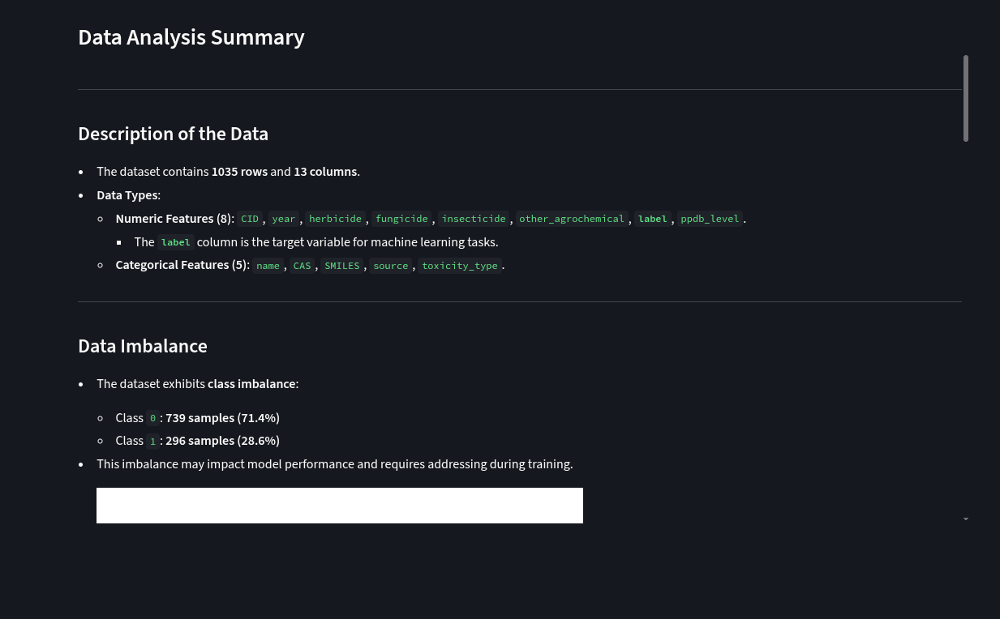
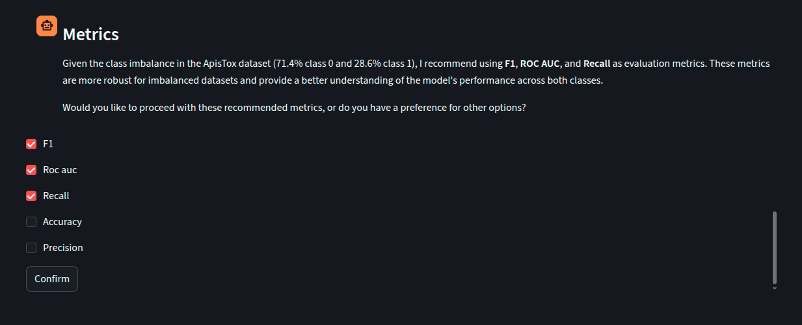
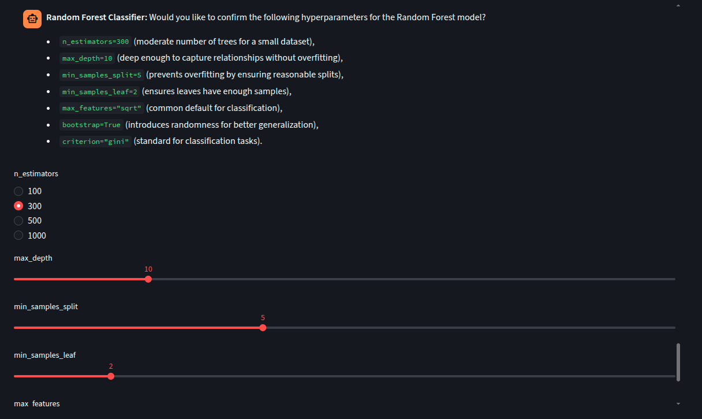
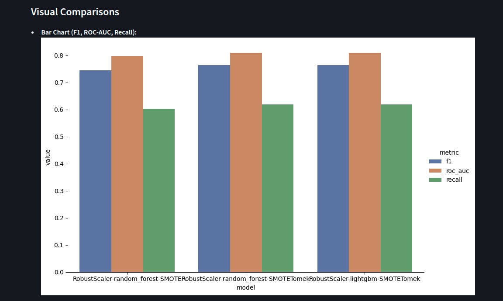
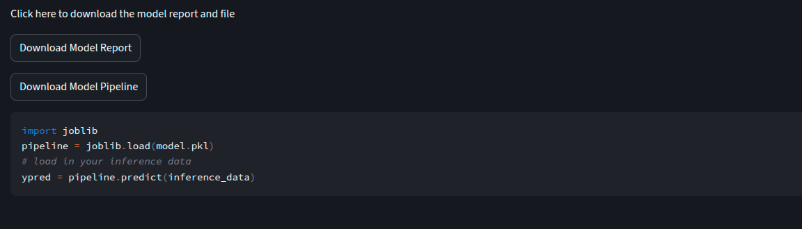

# LLM-Guided Machine Learning Classification Pipeline
_by Youssef Tarek_

LLM guided machine learning helps the user analyze datasets and develop well performing models, with little effort or domain knowledge. The agent provides insights on the data, suggesting the optimal design decisions for the user to approve. The process evaluates several model combinations, to find the best-performing model on a given dataset.

## Features
- Provides an EDA report on the dataset
- Suggests appropriate models and metrics
- Uses LLM-guided preprocessing decisions, such as encoding methods, skew handling, and dataset scaling
- Handles class imbalance
- Provides an evaluation report, including visualizations
- Provides a downloadable markdown report of the entire process from analysis to evaluation (see apistox_dataset_report.md for an example)
- Creates a downloadable .pkl file of the pipeline used for inference

## Screenshots
EDA Report


Metrics Selection


Hyperparameter Selection


Moel Comparison Bar Chart


Downloadable Report and Model



## How It Is Different
Other machine learning automation systems use brute-force, which is often time-consuming and hardware-intensive. The advantage of this system is that it uses LLM guided assistance to provide data-informed decisions and create ready-made deployable pipelines.


## Pipeline Overview

```
📊 Data Analysis Report
        ↓
🧹 Data Cleaning
        ↓
🔧 Null Handling
        ↓
🎯 Metric Selection
        ↓
🤖 Model Selection
        ↓
🔠 Feature Encoding
        ↓
📐 Skew Handling
        ↓
⚖️ Dataset Scaling
        ↓
🔀 Class Imbalance Handling
        ↓
🔍 Hyperparameter Selection
        ↓
🏋️ Training
        ↓
📈 Evaluation
        ↓
📝 Final Training Report
```

## Agent Architecture

The system was built using LangGraph, with a node for each step in the pipeline. Each node is composed of its own subgraph structure. All subgraphs are built using a custom subgraph builder method where the model, structured output, prompt and context are all configurable per node. The graph interrupts based on the user's input

## Design Decisions
Below are decisions made in design, implementation, and scope for this project:
- LangGraph was used to design the workflow due to its support for human-in-the-loop workflows, as well as its flexibility for building configurable subgraphs

- Using a subgraph per node makes it easier to switch out components and improves maintainability across the lengthy pipeline

- The system is built to include the user in every step in the pipline, so that they are informed of the decisions being made

- There are currently five models available to choose from, covering a diverse range of ML families

-  Each subgraph node (step in the pipeline) has its own configuration dictionary that specifies the structured output model, prompt, and the dataset information provided to the model as context


### Future Work
Adding support for more models, encoding and scaling techniques and more metrics
